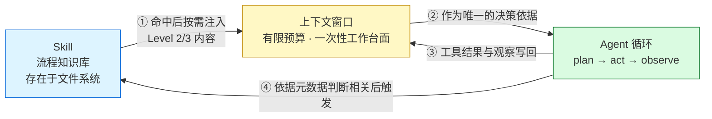

# 概念关系说明：Agent、大模型的上下文、Skill

> 配套资料：[agent.html](./agent.html) ｜ [llm-context.html](./llm-context.html) ｜ [skill.html](./skill.html)
> 生成日期：2026-09-04

## 一句话概括三者的关系

**上下文是资源，Agent 是消耗这份资源的决策循环，Skill 是按需进入这份资源的流程知识。**

三者不是并列关系，而是一条供给链：

```
Skill（流程知识）  ──按需注入──▶  上下文（有限预算）  ──作为决策依据──▶  Agent（行动循环）
        ▲                              ▲                                    │
        │                              │                                    │
        └────── 判断相关后触发 ─────────┴──────── 每轮结果写回 ─────────────┘
```

## 关系图



## 对照表

| 概念 | 本质 | 在系统中的角色 | 核心约束 |
|---|---|---|---|
| 上下文 | 一次性的有限工作台面 | **资源** — 所有信息的唯一通道 | token 预算有限，且越长越不可靠 |
| Agent | plan → act → observe 的决策循环 | **消费者** — 读上下文、改上下文 | 每轮都在消耗预算，错误会累积 |
| Skill | 文件夹形态的流程知识 | **供给物** — 按需注入上下文 | 不被触发就等于不存在 |

## 重点一：上下文如何影响 Agent 的工作

### 上下文是 Agent 唯一的"世界状态"

Agent 没有别的记忆。它对任务进展的全部了解，就是上下文里那点东西。
每一轮循环里发生的事是：

1. 模型读当前上下文，决定这一步做什么
2. 调用工具
3. **工具返回的结果作为新内容写进上下文**
4. 回到第 1 步

第 3 步是关键——**Agent 每行动一次，上下文就长大一点**。

### 由此产生的问题

Anthropic 把上下文称为"边际收益递减的有限资源"，并指出每引入一个 token 都会消耗模型的
"注意力预算"。对 Agent 来说，这个约束被放大了：

- **自主性越高，消耗越快。** 一个跑 50 轮的 Agent，会把几十轮的工具结果全部堆进上下文。
- **退化的表现是静默的。** 没有报错，但早期的约束被挤到深处甚至挤出窗口，
  Agent 开始违反项目开头定下的规范。这就是 context rot。
- **错误会级联。** 单步的小错会被写进上下文，下一轮又被当作事实继续推理。

### 工程上的三种回应

Anthropic 针对长时程任务给出了三种手段，它们本质上都是在跟上下文预算做斗争：

| 手段 | 做法 | 适用 | 风险 |
|---|---|---|---|
| 压缩 | 接近上限时总结，保留架构决策与未解 bug，丢弃冗余工具结果 | 需要大量来回对话的任务 | 过度压缩会丢掉后来才显出价值的细节 |
| 结构化笔记 | 把进度写到上下文之外的文件，需要时读回 | 有清晰里程碑的迭代开发 | 笔记本身需要维护 |
| 子 Agent 隔离 | 子 Agent 深挖数万 token，只回传 1,000–2,000 token 摘要 | 并行探索有价值的复杂研究 | 主 Agent 拿不到细节 |

## 重点二：Skill 如何沉淀可复用的任务知识

### 从"每次重说"到"写一次"

| | 提示词 | Skill |
|---|---|---|
| 存在形式 | 会话里的一段话 | 文件系统里的目录 |
| 生命周期 | 说完即散 | 跨会话、跨项目 |
| 能否版本管理 | 不能 | 能（跟代码一起提交） |
| 能否共享 | 靠复制粘贴 | 靠仓库分发 |
| 能否捆绑代码 | 不能 | 能，且代码不占上下文 |

### 沉淀机制：渐进式披露

Skill 把知识切成三层，按需进入上下文：

- **第 1 层（元数据）**：name + description，启动时就加载，每个约 100 tokens。
  Agent 靠它做"该不该用"的判断。
- **第 2 层（指令）**：SKILL.md 正文，判断相关时才读入，建议 5k tokens 以内。
- **第 3 层（资源与代码）**：附加文件和脚本，需要时才读。脚本执行只回传结果，代码本身不进上下文。

结果是：**一个 Skill 可以捆绑几十个参考文件，却几乎不占上下文。**

### 我的判断

这里是我读完几份一手来源后自己的看法，不是来源原文的转述：

**Skill 之所以长成现在这个样子，根本原因就是上下文有限。**

理由是这样的：如果上下文无限且用得好（实际上两个条件都不成立，但假设一下），
那最省事的做法就是把所有知识一次性全塞进系统提示，根本不需要什么"渐进式披露"、
不需要把内容拆成三层、不需要费心设计按需加载机制。
正是"上下文是有限资源"这个硬约束，逼出了 Skill 的整个设计。

顺着这个逻辑还能推出两点：

1. **Skill 和上下文管理解决的是不同层次的问题。**
   Skill 减少的是"需要常驻上下文的知识量"；
   但任务过程本身产生的数据（工具结果、探索轨迹）Skill 管不了，
   那些得靠压缩和子 Agent 隔离。**别指望装了 Skill 就不怕上下文撑爆。**

2. **Agent Skills 被做成开放标准不是偶然。**
   它采用"文件夹 + Markdown"这种最朴素的格式，没有私有协议。
   要跨平台可移植，就必须放弃精巧而封闭的设计——这个取舍和 MCP 是同一个思路。
   技术选型上的克制，往往是被现实约束逼出来的，不是审美偏好。

## 一个具体的串联场景

把三者放在一起看，用本仓库的实际工作流说明：

1. 我在 WorkBuddy 里说"学习一个新概念" →
2. Agent 扫描已安装 Skill 的**第 1 层元数据**，发现 `concept-learning-material` 的描述匹配 →
3. Agent 读取 **SKILL.md 正文（第 2 层）** 进入**上下文**，得知要查来源、要验证链接、要按固定结构输出 →
4. Agent 按流程搜索、验证链接、生成资料，每一步的结果都写回**上下文** →
5. 如果概念很多、上下文吃紧，就需要压缩或拆成子任务 →
6. 产出落到 `learning-materials/`，Skill 本身留在 `.workbuddy/skills/` 供下次复用

这条链里，Skill 决定 Agent 怎么做，上下文决定 Agent 能记住多少，
两者共同决定了 Agent 最终能走多远。

## 资料来源

本文的机制性描述均来自以下已验证的一手来源，文中未引入新来源：

- Anthropic. *Effective context engineering for AI agents*. <https://www.anthropic.com/engineering/effective-context-engineering-for-ai-agents>（HTTP 200，2026-09-04 验证）
- Anthropic. *Equipping agents for the real world with Agent Skills*. <https://www.anthropic.com/engineering/equipping-agents-for-the-real-world-with-agent-skills>（HTTP 200，2026-09-04 验证）
- Anthropic. *Building Effective AI Agents*. <https://www.anthropic.com/research/building-effective-agents>（HTTP 200，2026-09-04 验证）
- Chroma. *Context Rot: How Increasing Input Tokens Impacts LLM Performance*. <https://research.trychroma.com/context-rot>（HTTP 200，2026-09-04 验证）

**"我的判断"一节为个人观点，非来源原文的结论，请独立评判。**
